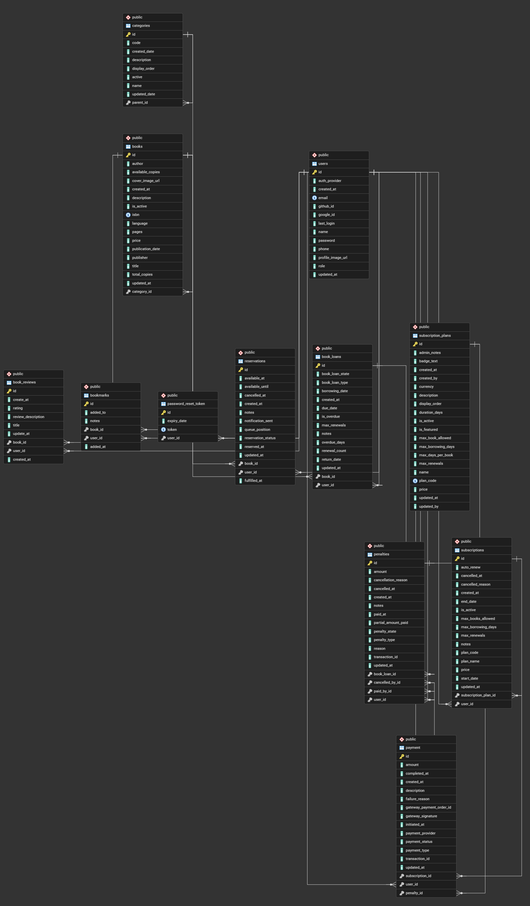

<h1 align="center">
    Borrowly | Library Management System
</h1>

  
  
  
  
  
  
  

**Borrowly-LMS** is a comprehensive Library Management System built with Spring Boot, designed to digitize and automate library operations. It provides a full platform for managing books, user subscriptions, book loans, payments, and penalties with modern, scalable architecture.

>  **NOTE:** This project is currently **UNDER DEVELOPMENT**. Additional features will be added, existing functionalities will be enhanced, and frontend development is planned.

---

## Database Design

- Organized and simple design for easy reference  
- Key tables: Users, Books, Categories, Subscriptions, BookLoans, Penalties, Payments
---

##  Key Features

### 1. Book & Category Management
- Organize and catalog books by categories
- Manage book inventory and availability
- Track book details and metadata

### 2. User Management & Authentication
- Secure registration and login using JWT
- Role-based access control
- User profile management
- Password reset via email

### 3. Subscription Management
- Flexible subscription plans
- Subscription lifecycle tracking (renewal, cancellation)
- Renewal and cancellation management

### 4. Book Loan Management
- Borrow and return books with automated tracking
- Borrow and due date configuration
- Renewal support (default max: 2 times)
- Track overdue books and overdue days
- Support multiple loan states (BORROWED, OVERDUE, RETURNED)

### 5. Penalty & Fine Management
- Automatic penalty generation for overdue or damaged books
- Multiple penalty types: Delay, Damage
- Track penalty states: UNPAID, PARTIALLY_PAID, PAID, CANCELLED
- Partial payment support
- Cancel penalties with reasons and audit trail
- Payment integration for penalty settlement

### 6. Integrated Payment Processing
- Stripe payment gateway for secure transactions
- Support for subscription and penalty payments
- Track payment status: Initiated, Completed, Failed
- Payment provider management and transaction tracking
- Comprehensive payment history and audit trail

### 7. Advanced Search & Filtering
- JPA Specifications-based complex queries
- Filter penalties by state, type, and user
- Paginated results for efficient retrieval

### 8. Security & Authentication
- JWT-based authentication
- Secure password management
- Role-based access control

### 9. Communication & Notifications
- Email integration for notifications (payment confirmations, password resets)
- Thymeleaf templates for formatted emails

---

##  Tech Stack
- **Framework:** Spring Boot 4.0.4  
- **Database:** PostgreSQL with JPA/Hibernate  
- **Authentication:** JWT
- **DTO Mapping:** MapStruct  
- **Payment Gateway:** Stripe
- **Email:** Spring Mail + Thymeleaf  
- **Code Quality:** Lombok  
- **API Documentation:** SpringDoc OpenAPI  
- **Language:** Java 17  

---

##  Architecture Highlights
- **Modular Design:** Separate modules for each domain (auth, book, loans, payment, penalty, subscription, user)  
- **Service Layer:** Encapsulates business logic  
- **Repository Pattern:** Data access with JPA repositories  
- **DTO Pattern:** Separate entity and API models  
- **Exception Handling:** Custom exception handling for business logic errors  
- **Shared Utilities:** Common functionality in `_shared` module (DTOs, configs, email, audit trails)

